# GOCAMO

## A digital camouflage pattern image generator written in Go

[](https://goreportcard.com/report/github.com/bradsec/gocamo)

GOCAMO is a Go program that generates military-styled digital camouflage patterns. The patterns can be generated using custom color palettes specified in a JSON file or via command-line arguments. Images are saved in PNG format in the specified `output` directory. The output filename shows the HEX colors used and the resolution of the image. Two or more colors can be used in pattern palettes for the woodland, multicam, blocks, blob, marpat, and fleck patterns.

## Features

- Generate digital camouflage patterns with customizable colors, unique patterns, and any resolution
- Configurable base pixel size for different pattern granularity
- Output images include color codes in the filename for easy reference
- Multi-core processing for improved performance when generating multiple patterns

## Generation Speed

Generation speed depends on the number of images, resolution, and base pixel size. Higher resolution and smaller base pixel sizes require more processing time. The program uses Go's concurrency features to leverage multiple CPU cores when processing multiple color palettes from a JSON file, significantly improving performance on multi-core systems.

## Optimized File Size

The program will produce optimized small PNG file sizes for high-resolution patterns (when generating without `-noise` or `-edge`):
- 280kB for a 4K image (`-w 3840 -h 2160`)
- 1.6MB for a 4K image with `-noise` added
- 9.4MB for a 4K image with `-edge` details added
- 10.5MB for a 4K image with `-noise` and `-edge` details added

## Pattern Types (woodland, multicam, blocks, blob, marpat, fleck, all, image)

### woodland (set using `-t woodland`, default if no type specified)

Layered woodland camouflage with a light base colour, large organic regions, medium branch/foliage-like marks, and small digital details. Woodland has the most traditional woodland feel: broad natural shapes with some pixel texture, and the lightest palette colour is automatically used as the background base.

```terminal
gocamo -c "#5a6b3c,#d4c5a7,#4a3f2a,#2d362a" -t woodland -w 900 -h 900
```

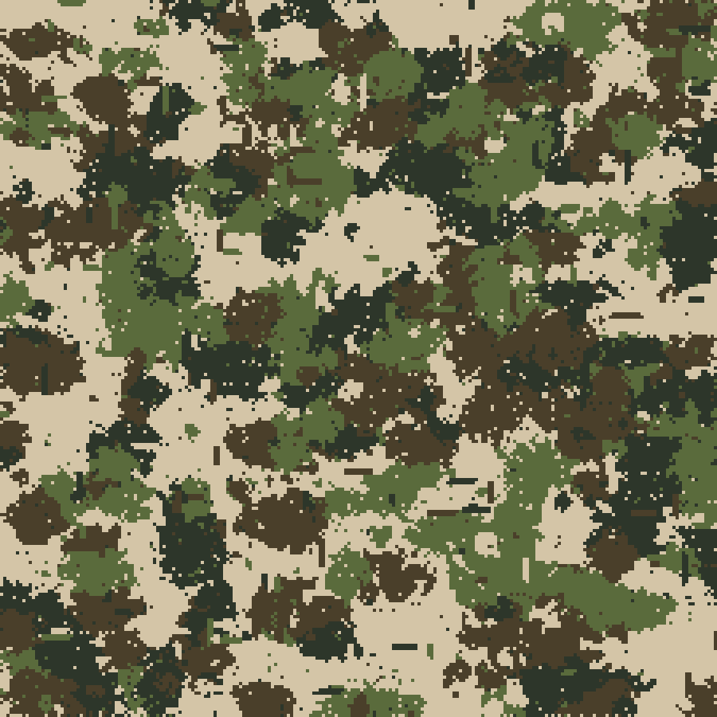

### multicam (set using `-t multicam`)

Dense organic camouflage with multi-scale blobs, directional flow, Perlin-noise edges, and fine speckled detail. multicam is the most textured and noisy-looking pattern, useful when you want a busier field with soft natural transitions rather than obvious square blocks.

```terminal
gocamo -c "#5a6b3c,#d4c5a7,#4a3f2a,#2d362a" -t multicam -w 900 -h 900
```

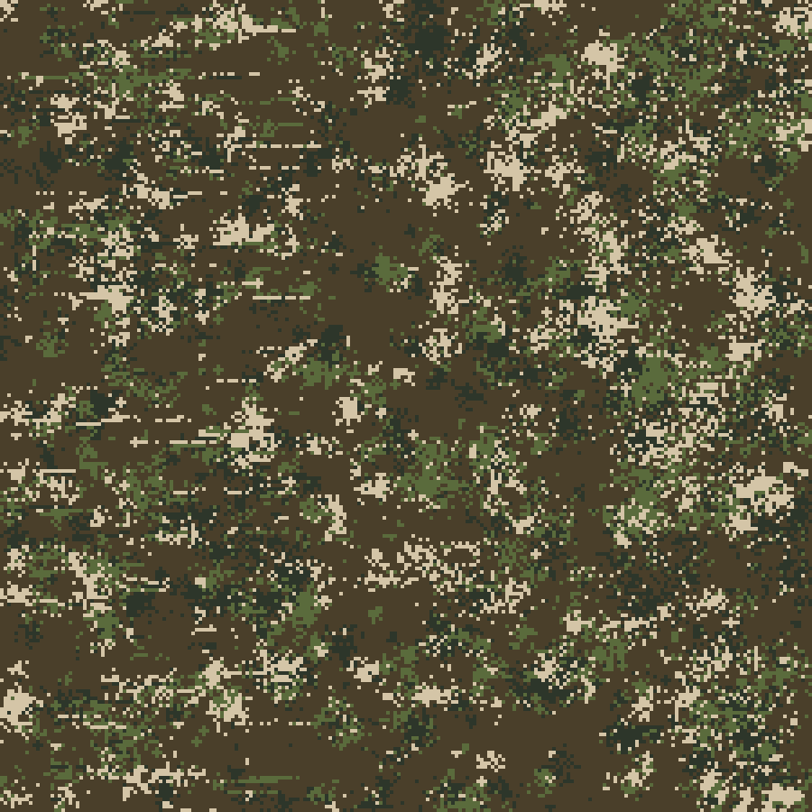

### blocks (set using `-t blocks`)

Geometric digital camouflage built from cellular-automata clustering plus larger square and rectangular regions. blocks is the most block-oriented pattern: hard edges, clear pixel structure, and visible rectangular groupings.

```terminal
gocamo -c "#5a6b3c,#d4c5a7,#4a3f2a,#2d362a" -t blocks -w 900 -h 900
```

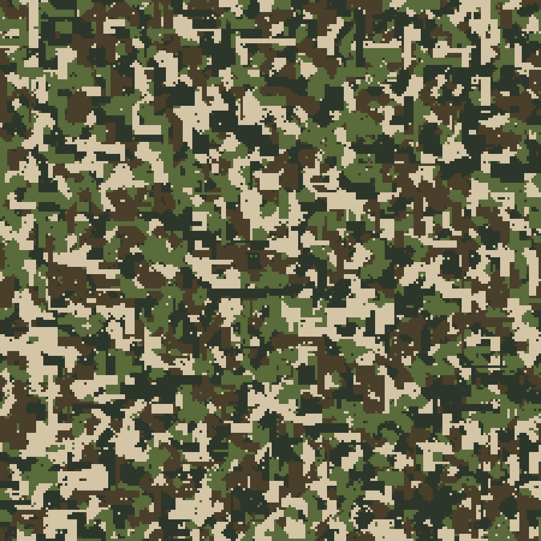

### blob (set using `-t blob`)

Cellular-automata camouflage that starts from weighted random colour placement and smooths it into compact clustered regions. blob sits between multicam and blocks: less speckled than multicam, less rectangular than blocks, with rounded organic patches.

```terminal
gocamo -c "#5a6b3c,#d4c5a7,#4a3f2a,#2d362a" -t blob -w 900 -h 900
```

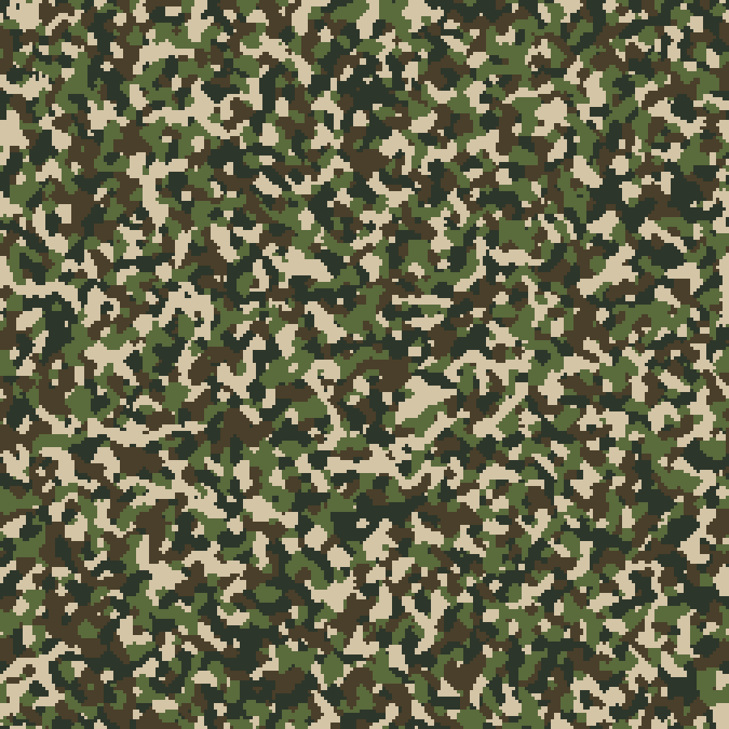

### marpat (set using `-t marpat`)

Digital military-style camouflage using weighted Voronoi seeding, directional rectangular cellular-automata shaping, small pixel blocks, and ratio correction. marpat is tuned for rectangular micro-clusters and controlled colour coverage, using 45/30/15/10 colour ratios by default when no custom `-r` value is provided.

```terminal
gocamo -c "#5a6b3c,#d4c5a7,#4a3f2a,#2d362a" -t marpat -w 900 -h 900
```

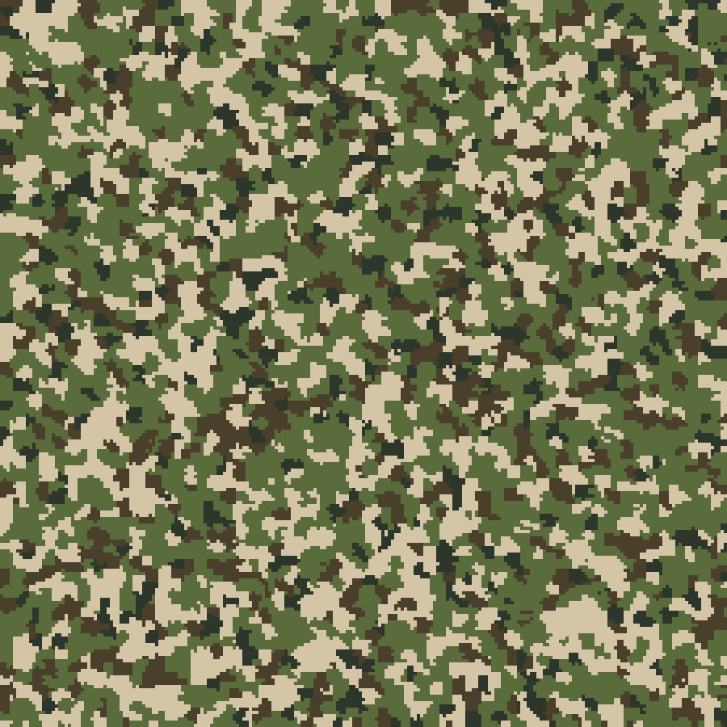

### fleck (set using `-t fleck`)

Flecktarn-inspired pattern of many small overlapping dots whose density is modulated by low-frequency noise, so the flecks clump into larger disruptive regions.

```terminal
gocamo -c "#5a6b3c,#d4c5a7,#4a3f2a,#2d362a" -t fleck -w 900 -h 900
```

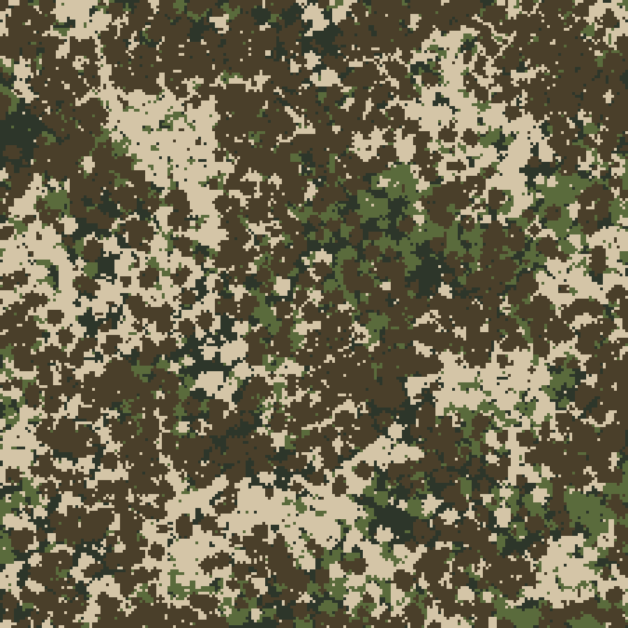

### all (set using `-t all`)
The all option generates patterns using all six pattern types (woodland, multicam, blocks, blob, marpat, fleck) for each color palette provided. This is useful when you want to see all pattern variations for comparison or when generating a complete set of patterns from the same color scheme.

```terminal
gocamo -c "#46482f,#6d6851,#9b967f,#1e2415" -t all -w 900 -h 900
```

When using `-t all`, the tool generates one pattern per algorithm (six in total) for each color palette.

## Base Pixel Size (`-b`)

The `-b` flag controls the size of the individual pixel blocks that build up the pattern. Lower values produce finer, more detailed patterns; higher values produce coarser, more blocky patterns. All pattern types scale together — use `-b` to match the pattern granularity to your output resolution or intended use.

`-b 4` (default — fine detail)

```terminal
gocamo -c "#5a6b3c,#d4c5a7,#4a3f2a,#2d362a" -t woodland -b 4 -w 600 -h 400
```

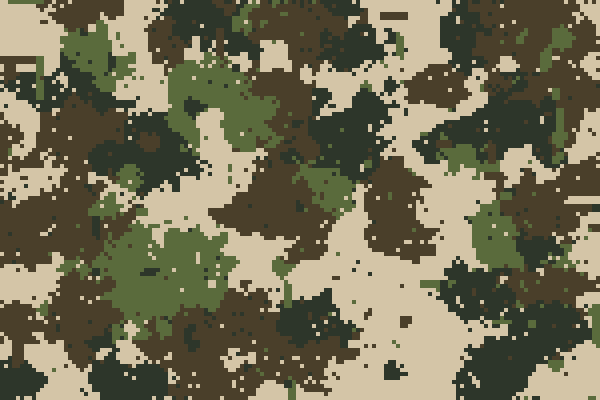

`-b 8` (medium grain)

```terminal
gocamo -c "#5a6b3c,#d4c5a7,#4a3f2a,#2d362a" -t woodland -b 8 -w 600 -h 400
```

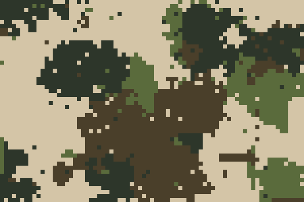

`-b 16` (coarse / large block)

```terminal
gocamo -c "#5a6b3c,#d4c5a7,#4a3f2a,#2d362a" -t woodland -b 16 -w 600 -h 400
```

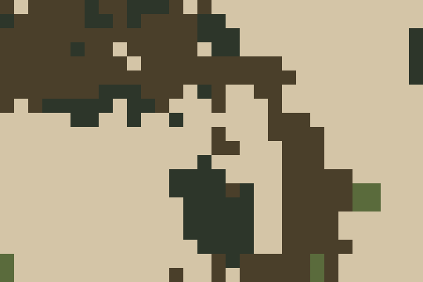

## Pattern Effects (`-edge`, `-noise`)

Both flags add per-pixel texture on top of any pattern type. They are off by default and can be combined.

- `-noise` gives every pixel a 5% chance of being blended 50/50 with a randomly chosen palette colour. The result is a sparse speckle scattered across the whole image, with dots taking on tints of the other palette colours.
- `-edge` adds detail along the base pixel grid: pixels on block boundaries (every `-b` pixels) get a 40% chance of a small random brightness variation. The result is a subtle grid-aligned texture that breaks up the hard edges between blocks.

Both effects increase PNG file size considerably because they reduce the large flat-colour areas that compress well (see Optimized File Size above).

`-noise`

```terminal
gocamo -c "#5a6b3c,#d4c5a7,#4a3f2a,#2d362a" -t blocks -w 600 -h 400 -noise
```

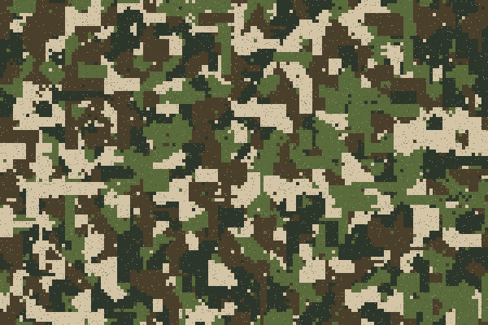

`-edge`

```terminal
gocamo -c "#5a6b3c,#d4c5a7,#4a3f2a,#2d362a" -t blocks -w 600 -h 400 -edge
```

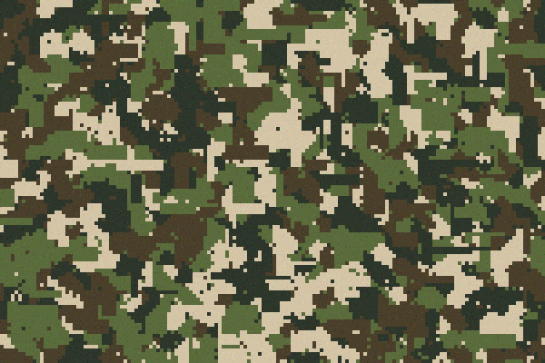

`-noise -edge`

```terminal
gocamo -c "#5a6b3c,#d4c5a7,#4a3f2a,#2d362a" -t blocks -w 600 -h 400 -noise -edge
```

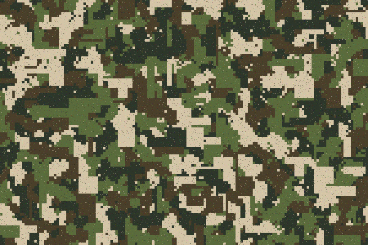

---

### image (set using `-t image`, uses images in the `input` directory as reference)
The ImageGenerator processes an input image to create a camouflage-like pattern based on the original image's colors and features. Loads the input image and resizes it to the target dimensions while maintaining aspect ratio. Applies max pooling to reduce the image size and enhance prominent features. Applies a Laplacian filter to enhance edges and details in the image. Uses k-means clustering to extract the main colors from the processed image. Maps each pixel in the processed image to the closest main color.

Reference (source) photo:


```terminal
gocamo -t image -w 900 -h 900
```

Pattern result with default `-b 4` and 4 colors `k 4`:

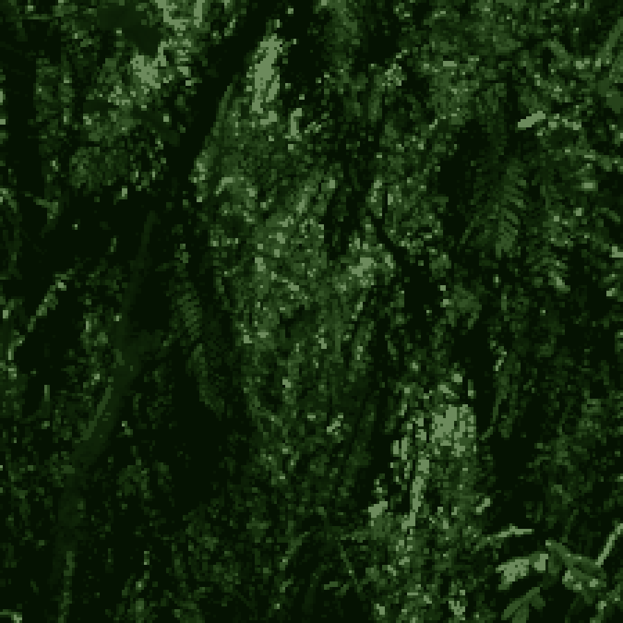

```terminal
gocamo -t image -w 900 -h 900 -b 10
```

Pattern result with `-b 10` and 4 colors:

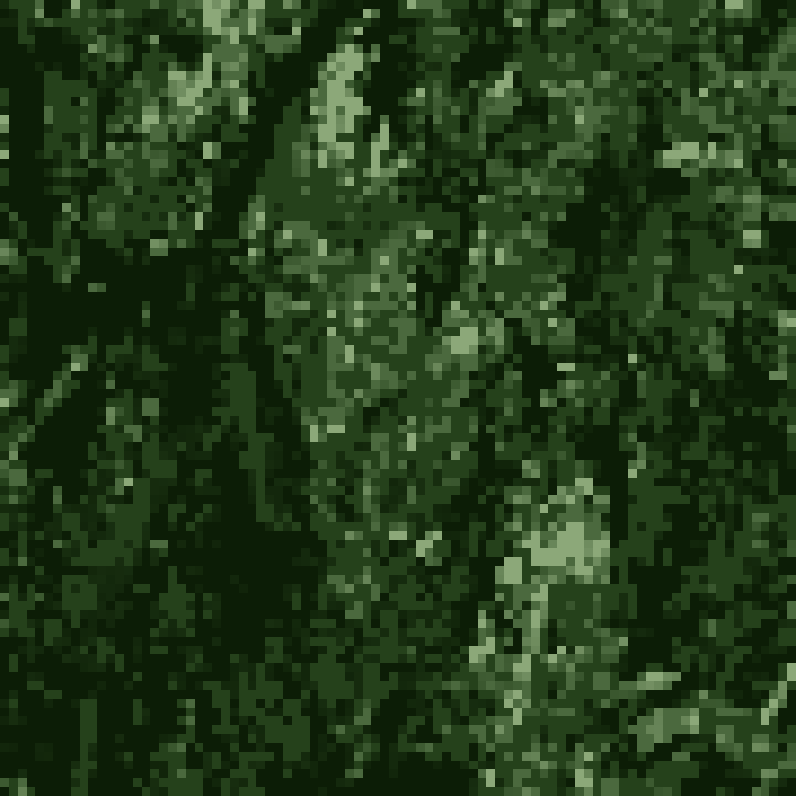

```terminal
gocamo -t image -w 900 -h 900 -k 16
```

Pattern result with default `-b 4` and 16 colors `-k 16`:

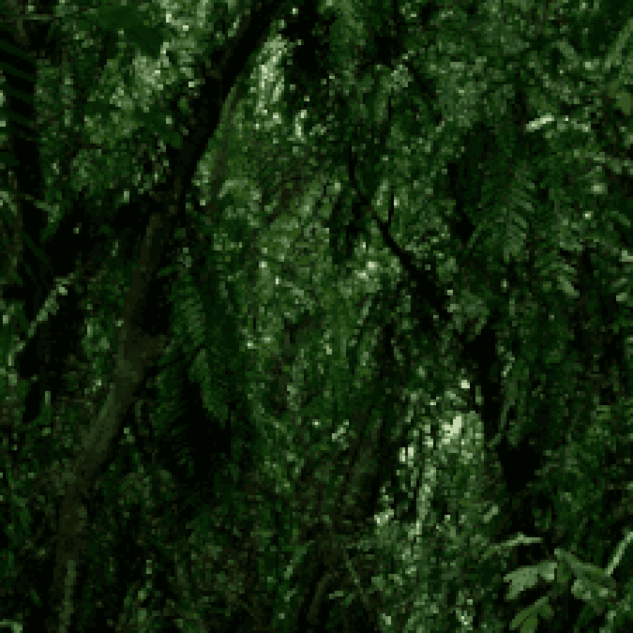

```terminal
gocamo -t image -w 900 -h 900 -b 10 -k 16
```

Pattern result with `-b 10` and 16 colors `-k 16`:

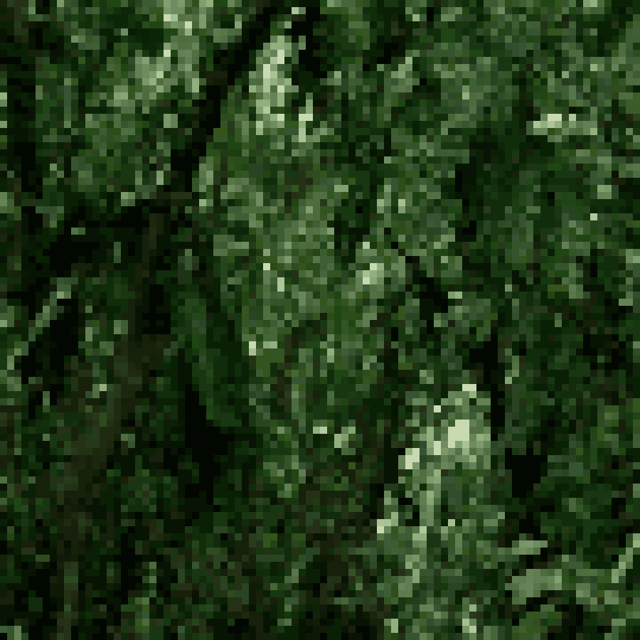


## Installing

### Option 1 Download the pre-built Binary files from [Releases](https://github.com/bradsec/gocamo/releases)

### Option 2 Use Go to install the latest version
If you have Go installed (https://go.dev/doc/install) you can install the latest version of gocamo with this command:
```terminal
go install github.com/bradsec/gocamo/cmd/gocamo@latest
````

### Option 3 Clone Repo and Build

```terminal
git clone https://github.com/bradsec/gocamo.git
cd gocamo
go build -o gocamo ./cmd/gocamo
# Copy the gocamo binary/executable to a directory in your system PATH
```

## Examples commands

1. Generate a single pattern with specified colors (defaults to woodland pattern):
   ```
   # Three color woodland pattern (default)
   gocamo -c "#ffffff,#012169,#e4002b"

   # Three color blob pattern
   gocamo -c "#ffffff,#012169,#e4002b" -t blob

   # Three color blocks pattern
   gocamo -c "#ffffff,#012169,#e4002b" -t blocks

   # Generate all 6 pattern types with same colors
   gocamo -c "#ffffff,#012169,#e4002b" -t all
   ```

2. Process multiple color palettes from a JSON file:
   ```
   # All color schemes as blob patterns
   gocamo -j colors.json -t blob

   # Process all color schemes in `colors.json` (defaults to woodland)
   gocamo -j colors.json

   # Generate all 6 pattern types for each color scheme in JSON file
   gocamo -j colors.json -t all
   ```

3. Make pattern from images use `-t image`, this option looks in the image input directory default `input` and processes the images, identifying clusters of colors to produce patterns based on the images. Will batch process any images in the directory. Change input directory with `-i` flag. Use `-b` to increase block pixel size in output pattern.
   ```
   gocamo -t image -b 10
   ```

3. Set custom dimensions:
   ```
   gocamo -j colors.json -w 3840 -h 2160
   ```

4. Set base pixel size (increase of decease pixels in patterns):
   ```
   gocamo -c "#ffffff,#012169,#e4002b" -b 6
   ```

5. Specify output directory:
   ```
   gocamo -j colors.json -o output_folder
   ```

6. Use specific number of CPU cores:
   ```
   gocamo -j colors.json -cores 4
   ```
7. Add noise to image (larger file size)
   ```
   gocamo -c "#ffffff,#012169,#e4002b" -noise
   ```
8. Add edge details to image (larger file size)
   ```
   gocamo -c "#ffffff,#012169,#e4002b" -edge
   ```
9. Add noise and edge details (largest file size)
   ```
   gocamo -c "#ffffff,#012169,#e4002b" -noise -edge
   ```

10. Apply milspec colour ratios (45/30/15/10%) to all pattern types:
    ```
    gocamo -c "#5a6b3c,#d4c5a7,#4a3f2a,#2d362a" -t all -r milspec -w 900 -h 900
    ```
    The `milspec` preset sets asymmetric colour coverage modelled on real military patterns — the first colour dominates at 45%, giving the base tone visual weight. Note: marpat already uses these ratios by default; `-r milspec` is most visible on woodland, multicam, blocks, and blob.

## Paths

- New patterns will save to output directory (default is output)

## Command Line Usage

```
Usage of ./gocamo:
  -b int
    	Set the base pixel size (will be adjusted if necessary) (default 4)
  -c string
    	Generate a single pattern using a comma-separated list of hex colors
  -cores int
    	Number of CPU cores to use (defaults to number of CPU cores)
  -edge
    	Add edge details to the pattern
  -h int
    	Set the image height (default 1500)
  -i string
    	Input directory containing images for image-based camouflage (default "input")
  -j string
    	Process a JSON file containing a list of color palettes
  -k int
    	Number of main colors for image-based camouflage (default 4)
  -noise
    	Add noise to the pattern
  -o string
    	The output directory for generated images (default "output")
  -r string
    	Color ratios: 'random', 'milspec' (45/30/15/10%), or integers like '2,1,3' (default: equal)
  -t string
    	Set the pattern type (woodland, multicam, blocks, blob, marpat, fleck, all, or image) (default "woodland")
  -w int
    	Set the image width (default 1500)
```

## JSON Input Format

When using the `-j` flag to process multiple patterns, you need to provide a JSON file containing color palettes. An example `colors.json` file is included in the repository. The format is as follows:

```json
[
  {
    "name": "woodland_sentinel",
    "colors": [
      "#5e8553",
      "#5c4f42",
      "#333330",
      "#c1bc94"
    ]
  },
  {
    "name": "mountain_mist",
    "colors": [
      "#9bb0c1",
      "#c4cecc",
      "#62779d",
      "#414458"
    ]
  }
]
```


## License

MIT. See [LICENSE](LICENSE).
