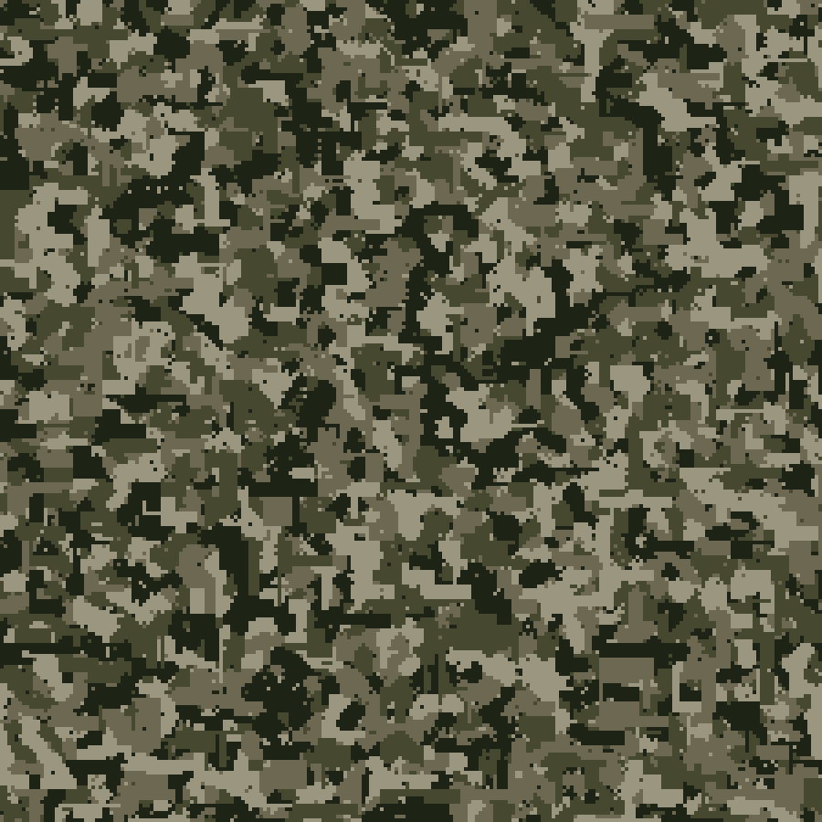
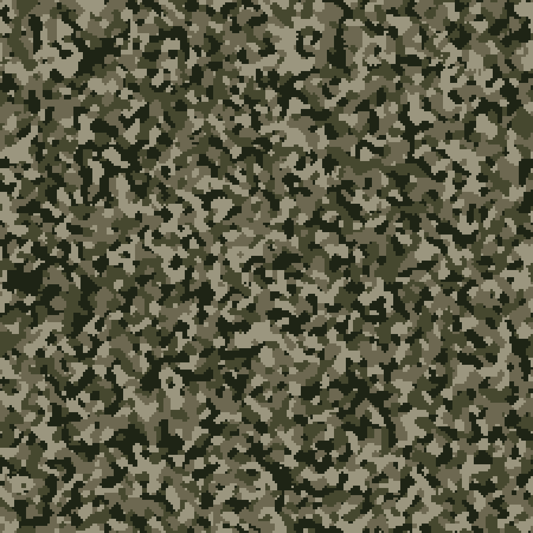
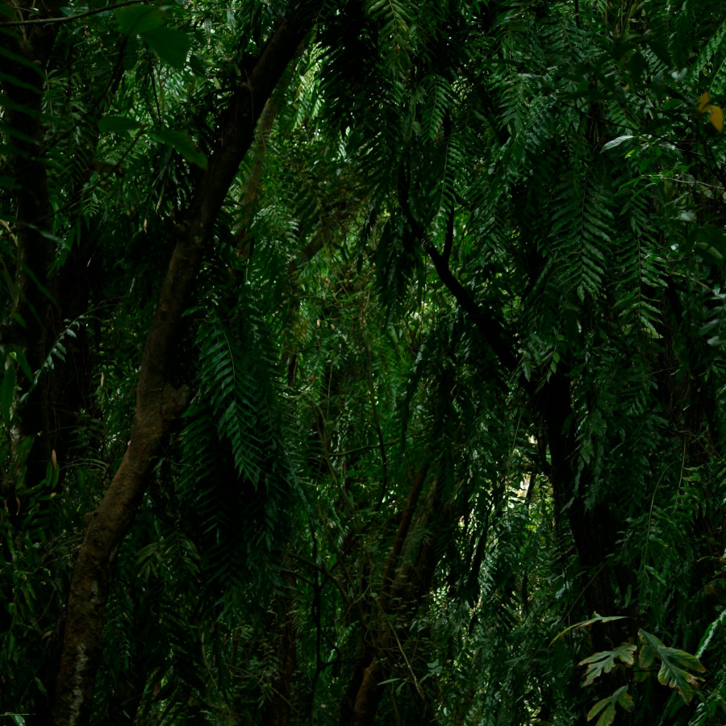
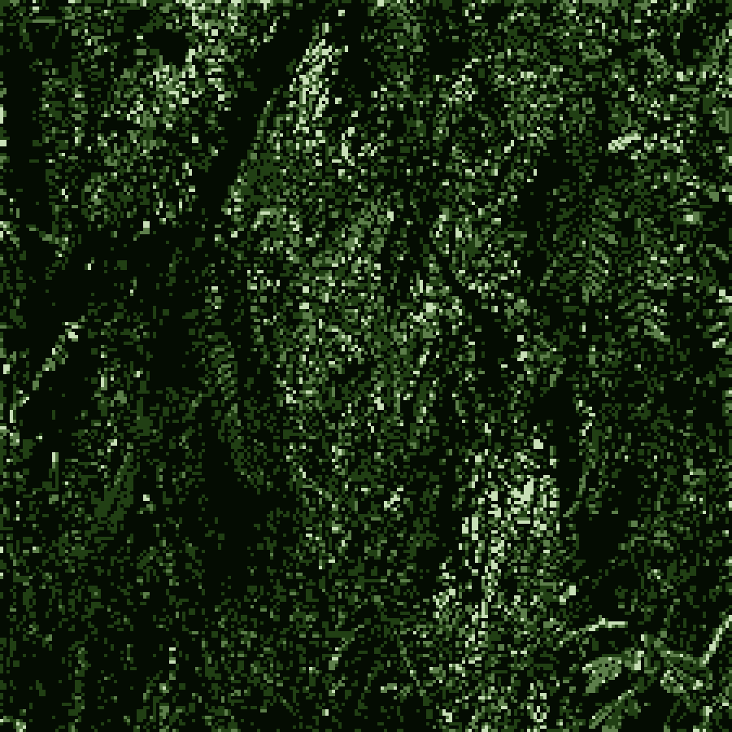
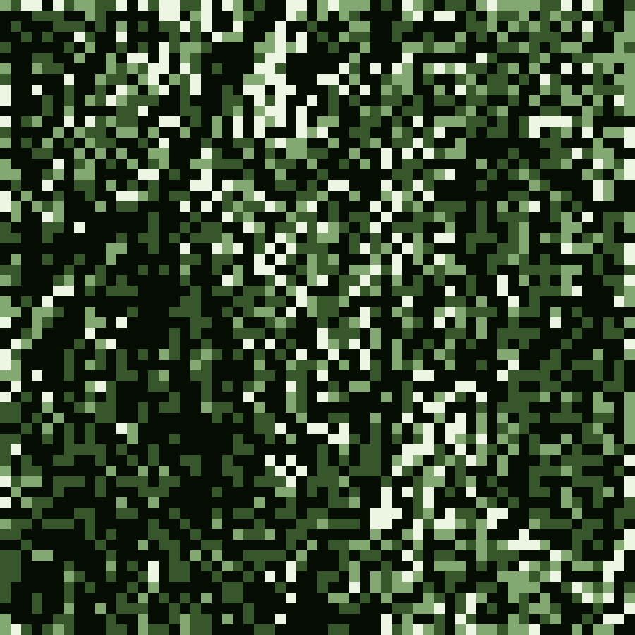

# GOCAMO

## A digital camouflage pattern image generator written in Go

GOCAMO is a Go program that generates military-styled digital camouflage patterns. The patterns can be generated using custom color palettes specified in a JSON file or via command-line arguments. Images are saved in PNG format in the specified `output` directory. The output filename shows the HEX colors used and the resolution of the image. Two or more colors can be used in pattern palettes.

## Features

- Generate digital camouflage patterns with customizable colors, unique patterns, and any resolution
- Configurable base pixel size for different pattern granularity
- Output images include color codes in the filename for easy reference
- Multi-core processing for improved performance when generating multiple patterns

## Generation Speed

Generation speed depends on the number of images, resolution, and base pixel size. Higher resolution and smaller base pixel sizes require more processing time. The program uses Go's concurrency features to leverage multiple CPU cores when processing multiple color palettes from a JSON file, significantly improving performance on multi-core systems.

## Optimized File Size

The program will produce optimized small PNG file sizes for high-resolution patterns (when generating without `-noise` or `-edge`):
- 280kB for a 4K image (`-w 3840 -h 2160`)
- 1.6MB for a 4K image with `-noise` added
- 9.4MB for a 4K image with `-edge` details added
- 10.5MB for a 4K image with `-noise` and `-edge` details added

## Pattern Types (box, blob, image)

### box (set using `-t box`, default if no type specified)
The BoxGenerator creates a pattern with angular, square-like shapes characteristic of digital camouflage. It uses a grid-based approach with cellular automaton rules to create clusters, and then adds larger squares and rectangles randomly. This results in a pattern with distinct, straight-edged shapes of various sizes, creating a more diverse and randomized appearance.

```terminal
gocamo -c "#46482f,#6d6851,#9b967f,#1e2415" -t box -w 900 -h 900
```



### blob (set using `-t blob`)
The BlobGenerator creates a pattern with more organic, blob-like shapes. It also uses a grid and cellular automaton approach, but with different rules that result in smoother, more curved shapes. This process creates a pattern that looks more like traditional camouflage with organic shapes.

```terminal
gocamo -c "#46482f,#6d6851,#9b967f,#1e2415" -t blob -w 900 -h 900
```



### image (set using `-t image`, uses images in the `input` directory as reference)
The ImageGenerator processes an input image to create a camouflage-like pattern based on the original image's colors and features. Loads the input image and resizes it to the target dimensions while maintaining aspect ratio. Applies max pooling to reduce the image size and enhance prominent features. Applies a Laplacian filter to enhance edges and details in the image. Uses k-means clustering to extract the main colors from the processed image. Maps each pixel in the processed image to the closest main color.

Reference (source) photo:



```terminal
gocamo -t image -w 900 -h 900
```

Pattern result with default `-b 4`:



```terminal
gocamo -t image -w 900 -h 900 -b 10
```

Pattern result with `-b 10`:



## Installing

### Option 1 Download the pre-built Binary files from [Releases](https://github.com/bradsec/gocamo/releases)

### Option 2 Use Go to install the latest version
If you have Go installed (https://go.dev/doc/install) you can install the latest version of gocamo with this command:
```terminal
go install github.com/bradsec/gocamo/cmd/gocamo@latest
````

### Option 3 Clone Repo and Build

```terminal
git clone https://github.com/bradsec/gocamo.git
cd gocamo
go build -o gocamo ./cmd/gocamo
# Copy the gocamo binary/executable to a directory in your system PATH
```

## Examples commands

1. Generate a single pattern with specified colors (defaults to blob pattern):
   ```
   # Three color blob pattern
   gocamo -c "#ffffff,#012169,#e4002b" -t blob

   # Three color box pattern
   gocamo -c "#ffffff,#012169,#e4002b" -t box
   ```

2. Process multiple color palettes from a JSON file:
   ```
   # All color schemes as blob patterns
   gocamo -j colors.json

   # Process all color schemes in `colors.json`
   gocamo -j colors.json
   ```

3. Make pattern from images use `-t image`, this option looks in the image input directory default `input` and processes the images, identifying clusters of colors to produce patterns based on the images. Will batch process any images in the directory. Change input directory with `-i` flag. Use `-b` to increase block pixel size in output pattern.
   ```
   gocamo -t image -b 10
   ```

3. Set custom dimensions:
   ```
   gocamo -j colors.json -w 3840 -h 2160
   ```

4. Set base pixel size (increase of decease pixels in patterns):
   ```
   gocamo -c "#ffffff,#012169,#e4002b" -b 6
   ```

5. Specify output directory:
   ```
   gocamo -j colors.json -o output_folder
   ```

6. Use specific number of CPU cores:
   ```
   gocamo -j colors.json -cores 4
   ```
7. Add noise to image (larger file size)
   ```
   gocamo -c "#ffffff,#012169,#e4002b" -noise
   ```
8. Add edge details to image (larger file size)
   ```
   gocamo -c "#ffffff,#012169,#e4002b" -edge
   ```
9. Add noise and edge details (largest file size)
   ```
   gocamo -c "#ffffff,#012169,#e4002b" -noise -edge
   ```

## Paths

- New patterns will save to output directory (default is output)

## Command Line Usage

```
Usage of ./gocamo:
  -b int
    	Set the base pixel size (will be adjusted if necessary) (default 4)
  -c string
    	Generate a single pattern using a comma-separated list of hex colors
  -cores int
    	Number of CPU cores to use (1-24 available) (default 24)
  -edge
    	Add edge details to the pattern
  -h int
    	Set the image height (default 1500)
  -i string
    	Input directory containing images for image-based camouflage (default "input")
  -j string
    	Process a JSON file containing a list of color palettes
  -k int
    	Number of main colors for image-based camouflage (default 4)
  -noise
    	Add noise to the pattern
  -o string
    	The output directory for generated images (default "output")
  -t string
    	Set the pattern type (blob, box, or image) (default "box")
  -w int
    	Set the image width (default 1500)
```

## JSON Input Format

When using the `-j` flag to process multiple patterns, you need to provide a JSON file containing color palettes. An example `colors.json` file is included in the repository. The format is as follows:

```json
[
  {
    "name": "woodland_sentinel",
    "colors": [
      "#5e8553",
      "#5c4f42",
      "#333330",
      "#c1bc94"
    ]
  },
  {
    "name": "mountain_mist",
    "colors": [
      "#9bb0c1",
      "#c4cecc",
      "#62779d",
      "#414458"
    ]
  }
]
```

## License

This project is open source and available under the [MIT License](LICENSE).
