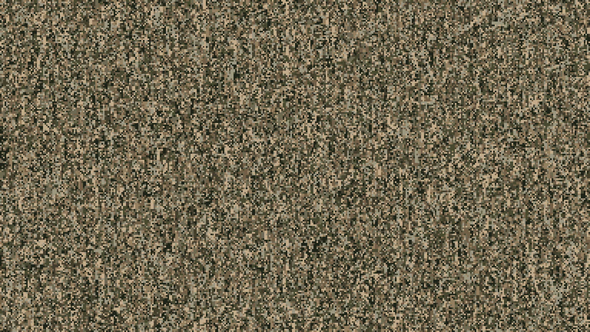

# GOCAMO

## A digital camouflage pattern image generator written in Go

A Go program that generates digital camouflage patterns using only the standard library. The patterns can be generated using custom color palettes specified in a JSON file or via other commandline arguments. Images are saved in PNG format in the specified `output` directory. The output filename shows the HEX colors used and resolution of the image. Two or more colors can be used in pattern palettes.

## Installing

To install gocamo, you need to have Go installed on your system (https://go.dev/doc/install). Once you have Go installed, you can either clone repo and run from source or download and install with the following command:

```terminal
go install github.com/bradsec/gocamo@latest
```

### Command Line Usage

```
 ######   ######   ######  #####  ###    ###  ###### 
##       ##    ## ##      ##   ## ####  #### ##    ##
##   ### ##    ## ##      ####### ## #### ## ##    ##
##    ## ##    ## ##      ##   ## ##  ##  ## ##    ##
 ######   ######   ###### ##   ## ##      ##  ###### 

Usage:

gocamo [OPTIONS]

Available options:

-r:  Generate a single pattern with random colors.
     Example: gocamo -r

-c:  Generate a single pattern using a comma-separated list of hex colors.
     Example: gocamo -c "#ffffff,#012169,#e4002b"

-j:  Batch process a JSON file containing a list of color palettes.
     Example: gocamo -j "colors.json"

-w:  Set the image width (default is 3840).
-h:  Set the image height (default is 2160).
     Example: gocamo -j colors.json -w 1920 -h 1080

-o:  The output directory or folder for generated images (default creates an 'output' in current directory).
     Example: gocamo -j colors.json -o thisfolder

-lg: Set the size of the large squares in the pattern (default is 20).
-sm: Set the size of the small squares in the pattern (default is 10).
     Example: gocamo -r -lg 50 -sm 25
```

### Generation Speed

Below output generating 357 different color palette 4K patterns from `colors.json` on a Intel i7 Gen10. The program uses goroutines when processing multiple color palettes from the JSON file, this can be processor intensive depending on number of images, resolution and size of squares used (higher resolution and smaller squares sizes require greater processing).

```terminal
[GENERATING] Digital Camouflage Patterns in 3840x2160...
[GENERATING] Processing 357 color palettes from colors.json...
[GENERATION] Completed in 37.95 seconds.
```

### Sample Image
Generated with the following command:  
```terminal
gocamo -c "#46482f,#6d6851,#9b967f,#1e2415,#726146,#443f2c,#c1ab89,#937e5e"
```


