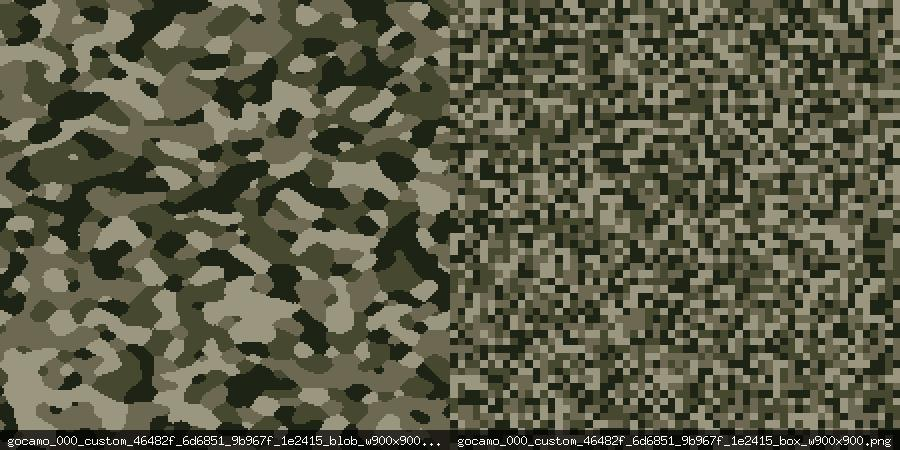
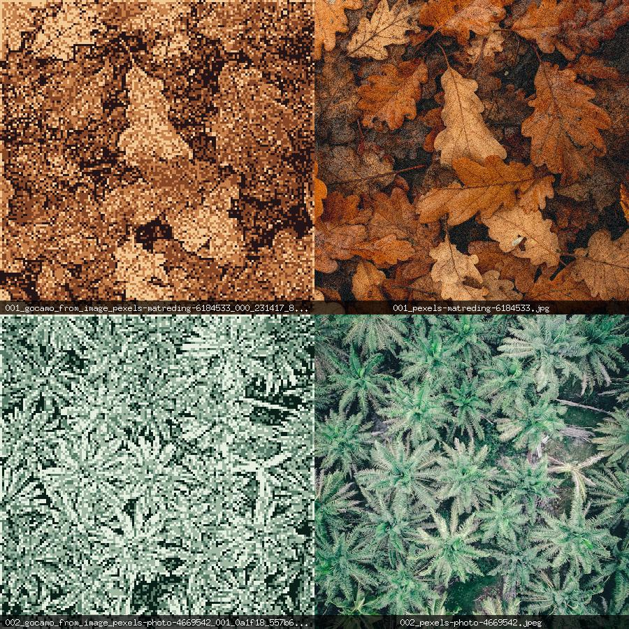
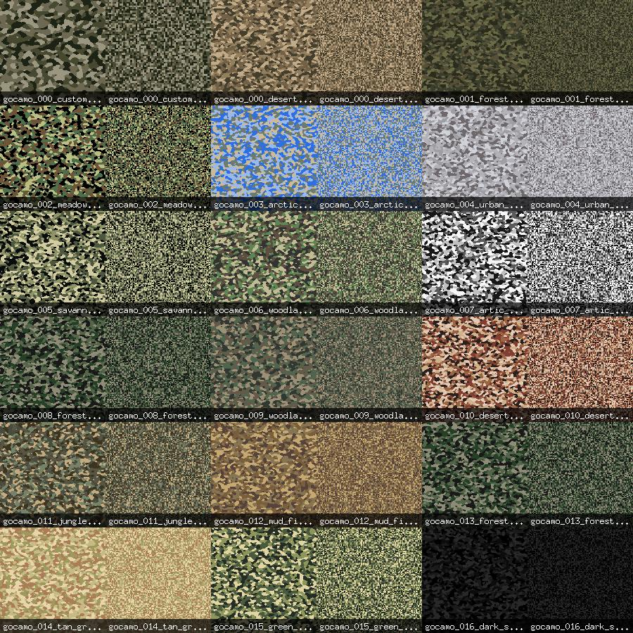
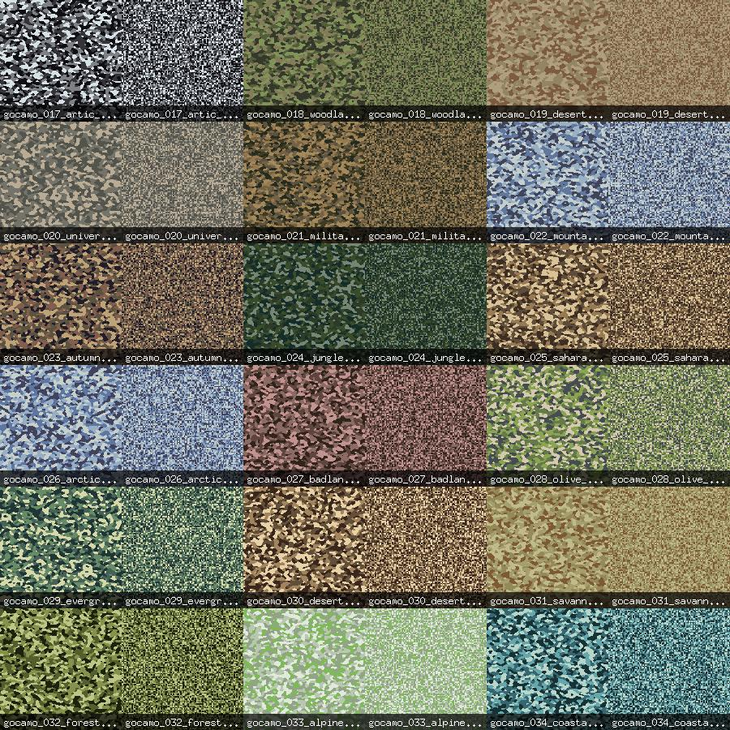
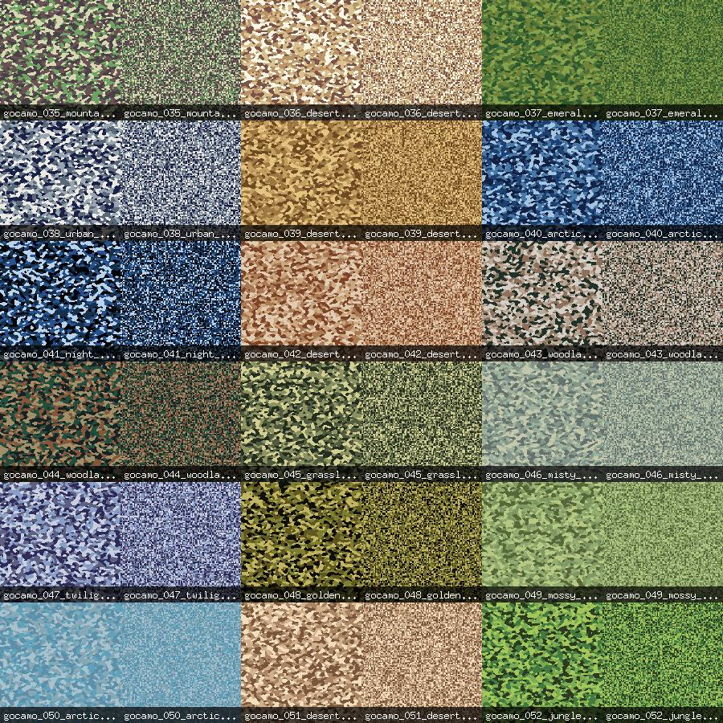
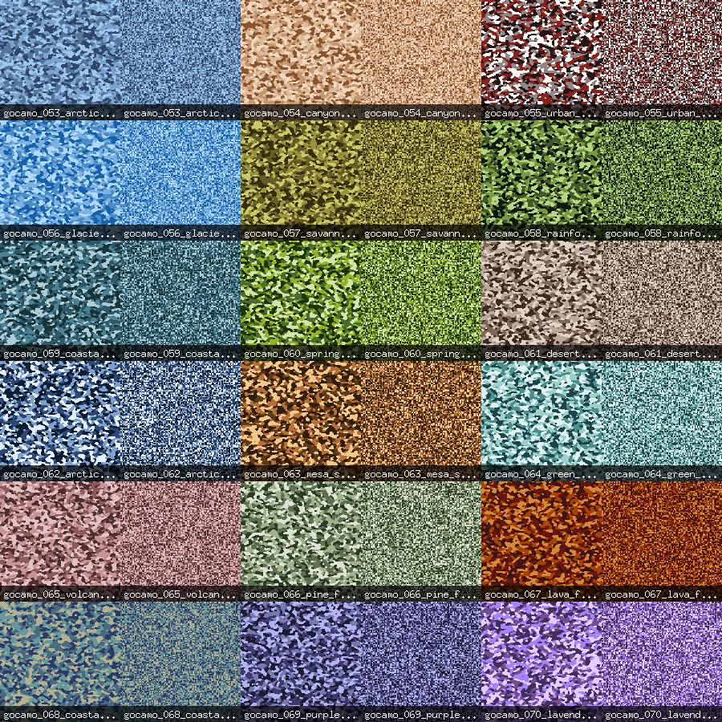
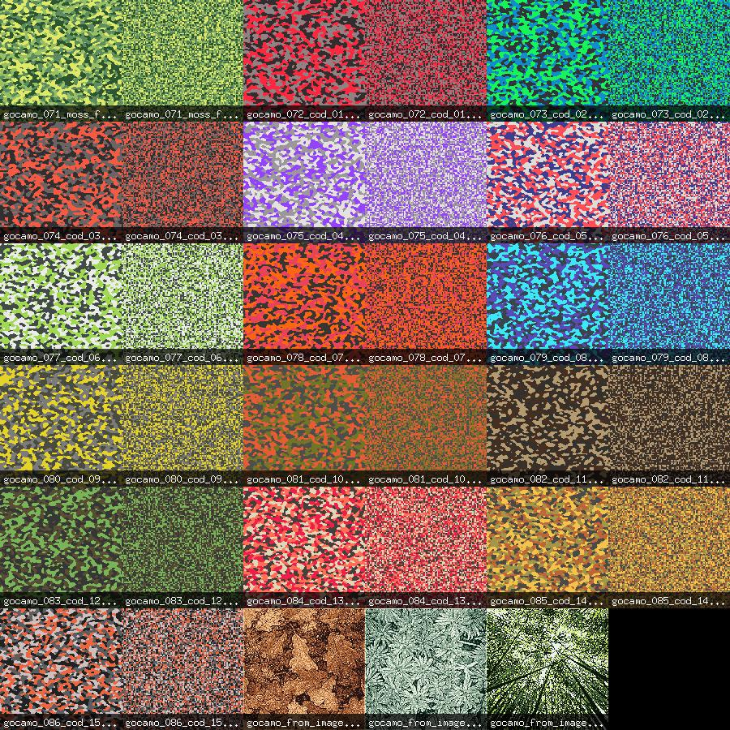

# GOCAMO

## A digital camouflage pattern image generator written in Go

GOCAMO is a Go program that generates military styled digital camouflage patterns. The patterns can be generated using custom color palettes specified in a JSON file or via command-line arguments. Images are saved in PNG format in the specified `output` directory. The output filename shows the HEX colors used and the resolution of the image. Two or more colors can be used in pattern palettes.

## Installing

To install GOCAMO, you need to have Go installed on your system (https://go.dev/doc/install). Once you have Go installed, 

```terminal
# 1. Clone the repo
git clone https://github.com/bradsec/gocamo.git

cd gocamo

# 2. Build the applicaton
go build -o gocamo ./cmd/gocamo

# 3. Run the program see usage flags below
```

## Examples commands

1. Generate a single pattern with specified colors (defaults to blob pattern):
   ```
   # Defaults to blob pattern
   gocamo -c "#ffffff,#012169,#e4002b"

   # Change pattern to box or pixelated use -t box
   gocamo -c "#ffffff,#012169,#e4002b" -t box
   ```

2. Process multiple color palettes from a JSON file:
   ```
   # All color schemes as blob patterns
   gocamo -j colors.json

   # All color schemes as box or pixelated patterns
   gocamo -j colors.json -t box
   ```

3. Make pattern from images use `-t image`, this option looks in the image input directory default `input` and processes the images, identifying clusters of colors to produce patterns based on the images. Will batch process any images in the directory. Change input directory with `-i` flag. Use `-b` to increase block pixel size in output pattern.
   ```
   gocamo -t image -b 10
   ```

3. Set custom dimensions:
   ```
   gocamo -j colors.json -w 3840 -h 2160
   ```

4. Set base pixel size (increase of decease pixels in patterns):
   ```
   gocamo -c "#ffffff,#012169,#e4002b" -b 6
   ```

5. Specify output directory:
   ```
   gocamo -j colors.json -o output_folder
   ```

6. Use specific number of CPU cores:
   ```
   gocamo -j colors.json -cores 4
   ```

## Paths

- New patterns will save to output directory (default is output)

## Command Line Usage

```
Usage of ./gocamo:
  -b int
    	Set the base pixel size (will be adjusted if necessary) (default 4)
  -c string
    	Generate a single pattern using a comma-separated list of hex colors
  -cores int
    	Number of CPU cores to use (1-24 available) (default 24)
  -edge
    	Add edge details to the pattern
  -h int
    	Set the image height (default 1500)
  -i string
    	Input directory containing images for image-based camouflage (default "input")
  -j string
    	Process a JSON file containing a list of color palettes
  -k int
    	Number of main colors for image-based camouflage (default 4)
  -noise
    	Add noise to the pattern
  -o string
    	The output directory for generated images (default "output")
  -t string
    	Set the pattern type (blob, box, or image) (default "blob")
  -w int
    	Set the image width (default 1500)
```

## Features

- Generate digital camouflage patterns with customisable colors
- Specify colors directly via command line or use a JSON file for batch processing
- Adjustable image dimensions
- Configurable base pixel size for different pattern granularity
- Output images include color codes in the filename for easy reference
- Multi-core processing for improved performance when generating multiple patterns 

## Generation Speed

Generation speed depends on the number of images, resolution, and base pixel size. Higher resolution and smaller base pixel sizes require more processing time. The program uses Go's concurrency features to leverage multiple CPU cores when processing multiple color palettes from a JSON file, significantly improving performance on multi-core systems.

## JSON Input Format

When using the `-j` flag to process multiple patterns, you need to provide a JSON file containing color palettes. An example `colors.json` file is included in the repository. The format is as follows:

```json
[
  {
    "name": "woodland_sentinel",
    "colors": [
      "#5e8553",
      "#5c4f42",
      "#333330",
      "#c1bc94"
    ]
  },
  {
    "name": "mountain_mist",
    "colors": [
      "#9bb0c1",
      "#c4cecc",
      "#62779d",
      "#414458"
    ]
  }
]
```

## Sample Images

Full resolution output images can be found in `output` folder of this repo.

```terminal
gocamo -c "#46482f,#6d6851,#9b967f,#1e2415" -w 900 -h 900
gocamo -c "#46482f,#6d6851,#9b967f,#1e2415" -w 900 -h 900 -t box
```


### Using photos image as reference `-t image`



### Other examples using `colors.json` color palettes







## License

This project is open source and available under the [MIT License](LICENSE).
